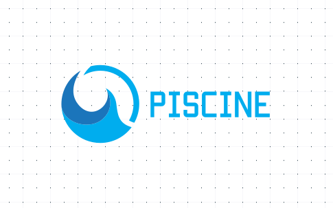

# Intégration Piscinexa pour Home Assistant (version 1.0.11) 💧
Ce composant personnalisé Home Assistant vous permet de gérer la qualité de l’eau de votre piscine (pH, chlore, température, volume) ainsi que la filtration, les recommandations de traitement, et d'ajouter des automatisations personnalisées.
## Langues supportées 🌍
L'intégration Piscinexa prend en charge plusieurs langues : français et anglais. Les chaînes visibles dans l'interface utilisateur sont traduites en fonction de la langue configurée dans Home Assistant.
## Installation ⚙️

---

## ⚙️ Setup

Shortcut:  
  

- Allez dans **Paramètres -> Intégrations -> Ajouter une intégration**  
- Cherchez **"Piscinexa** et suivez les instructions dans le **config flow**.  

---

- Copiez le dossier custom_components/piscinexa dans le répertoire config/custom_components/ de votre Home Assistant.- Redémarrez Home Assistant.- Allez dans **Paramètres → Appareils & services → Ajouter une intégration**.- Recherchez **Piscinexa**, suivez les étapes de configuration.- Configurez les dimensions, le pH/chlore actuels et cibles.
## Fonctionnalités 🧪
- Calcul du volume d’eau- Temps de filtration recommandé- Quantité de pH et chlore à ajouter- Capteur de log intégré (sensor.piscinexa_log)- Entrées numériques ajustables via l’UI- Services personnalisés :  - piscinexa.test_calcul  - piscinexa.reset_valeurs- Boutons intégrés à l’interface- Tableau de bord YAML prêt à l’emploi
## Mise à jour 🔄
Si vous installez manuellement, remplacez simplement le dossier custom_components/piscinexa par la nouvelle version, puis redémarrez Home Assistant.
## Exemple de tableau de bord 📊
Un fichier YAML est fourni ici : piscine_dashboard_custom_component.yaml
## Changelog 📜
Consultez le fichier CHANGELOG.md pour voir l'historique des versions et des modifications de l'intégration Piscinexa.
## Licence 📄
L'intégration Piscinexa est distribuée sous la licence MIT. Consultez le fichier LICENSE pour plus de détails.
## Signaler un problème 🐞
Si vous rencontrez des bugs ou avez des suggestions, veuillez ouvrir une issue sur GitHub.
