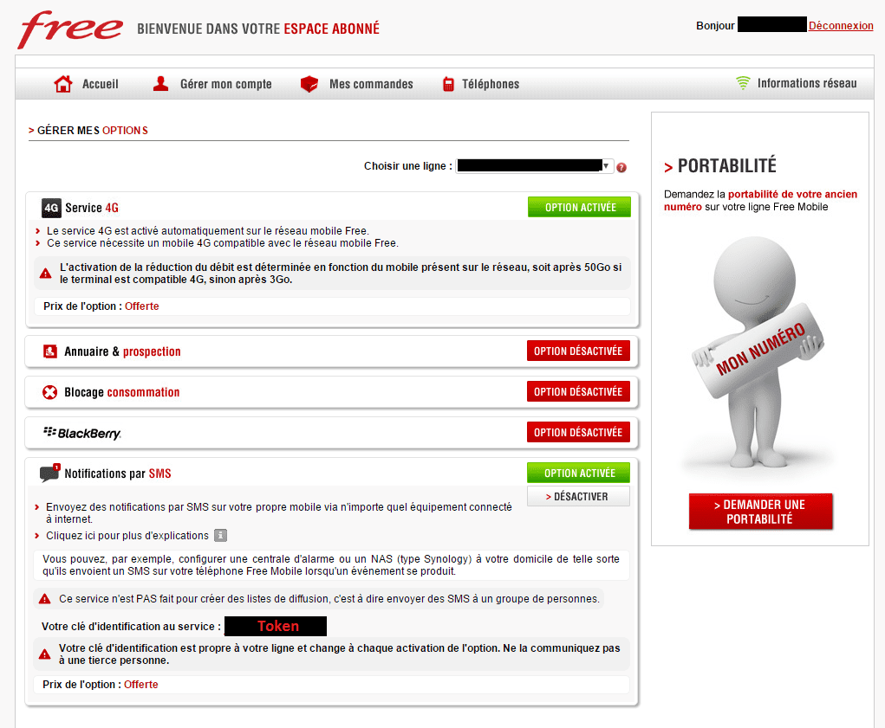

# 📨 Free Mobile SMS XA – Intégration Home Assistant


[](https://github.com/XAV59213/freesmsxa/releases)
[](https://hacs.xyz/)
[](./LICENSE)

**Free Mobile SMS XA** est une intégration personnalisée pour [Home Assistant](https://www.home-assistant.io/) qui permet d’envoyer des notifications **par SMS** via l’API gratuite de Free Mobile. Elle prend en charge plusieurs lignes, crée des entités (capteurs, boutons, services `notify`) et offre une interface complète dans Lovelace.

---

## 🔧 Fonctionnalités

- 🔔 Envoi de SMS via `notify.nom_du_service`
- 👥 Support **multi-utilisateurs** (ex : `Papa`, `Maman`)
- 📊 Capteur de **statut enrichi** : nombre total de SMS, date du dernier envoi, journal
- 🔘 Bouton test SMS personnalisable
- 🧾 Historique des 10 derniers messages
- 🎨 Carte Lovelace complète prête à l’emploi
- 🧩 Intégration via l’interface graphique Home Assistant

---

## 📸 Aperçu

### 🛠 Interface de configuration


### 🧩 Services configurés


### 🔑 Interface Free Mobile (Clé API)



---

## ⚙️ Setup

Shortcut:  
[](https://my.home-assistant.io/redirect/config_flow_start/?domain=freesmsxa)  

- Allez dans **Paramètres -> Intégrations -> Ajouter une intégration**  
- Cherchez **"Free SMS"** et suivez les instructions dans le **config flow**.  

---

## 🧰 Installation

### 📦 Via HACS (recommandé)

1. Ouvre **HACS > Intégrations**
2. Clique sur **les trois points > Dépôts personnalisés**
3. Ajoute :  
   ```
   https://github.com/XAV59213/freesmsxa
   ```
4. Sélectionne la catégorie `Intégration`
5. Installe **Free Mobile SMS XA**
6. Redémarre Home Assistant
7. Va dans **Paramètres > Appareils et services > Ajouter une intégration**
8. Cherche `Free Mobile SMS XA` et ajoute une ligne

---

## 🔐 Obtenir tes identifiants Free Mobile

1. Connecte-toi à ton [espace abonné Free Mobile](https://mobile.free.fr/moncompte)
2. Va dans **Gérer mes options**
3. Active **Notifications par SMS**
4. Copie ton **Identifiant utilisateur** et ta **Clé API**

---

## ⚙️ Exemple d’automatisation

```yaml
alias: Alerte Température Piscine
trigger:
  - platform: numeric_state
    entity_id: sensor.temperature_eau
    above: 30
action:
  - service: notify.papa_sms
    data:
      message: "⚠️ Température de la piscine trop élevée !"
```

---

## 📊 Carte Lovelace personnalisée

```yaml
type: vertical-stack
cards:
  - type: entity
    entity: sensor.free_mobile_sms_papa_sms_status
    name: 📲 Papa - État SMS
  - type: button
    name: ✉️ Envoyer un test
    entity: button.test_sms_12345678
    tap_action:
      action: call-service
      service: button.press
      target:
        entity_id: button.test_sms_12345678
  - type: markdown
    title: 📝 Historique des SMS
    content: >
      
      
      
      • **{{ item.time }}** : {{ item.message }}
      
      
      Aucun SMS envoyé.
      
```

---

## 🛡️ Sécurité

- ✅ Aucune donnée externe utilisée
- ✅ Aucune collecte de messages
- ✅ La Clé API est invisible après validation
- ✅ 100 % local, 100 % Free Mobile

---

## 🧾 Licence

Distribué sous **GNU LGPL v2.1** – [Voir la licence](./LICENSE)

---

## 📚 Documentation

> Intégration créée avec ❤️ pour Home Assistant.  
> Pour toute question ou amélioration, [ouvre une issue](https://github.com/XAV59213/freesmsxa/issues).
